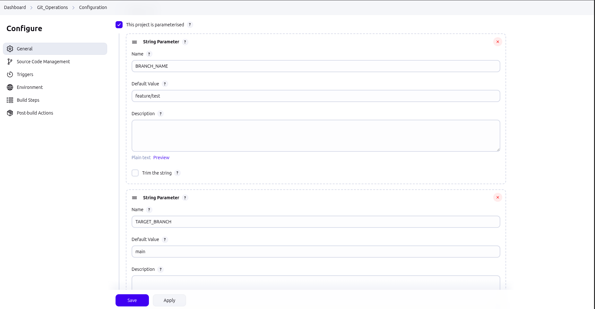
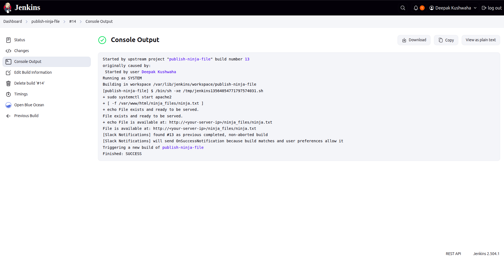

### Here is the Part-1 of Assignemnt-1
**git_operations job -** 
**Part 1:- 
 
Create a Jenkins job via which you will be able to perform the below operations & if any of the steps fail a Slack and Email notification should be sent: 
Create a branch 
List all branches 
Merge one branch with another branch 
Rebase one branch with another branch 
Delete a branch**

## ScreenShot part-1

### Here is the Part-2 of Assignemnt-1
**Part 2:-

Create a Jenkins job that takes input parameter string <Ninja Name> and it should -  
Create a file  
Add content in the file "<Ninja Name> from DevOps Ninja" 
         
Create another Jenkins job that should -  
Publish the file content created in job 1 using a web server 
       
Configurations should be such that -  
The second job must be triggered automatically only after completing the first job successfully. 
If any steps fail, a Slack and Email notification should be sent. 
If all jobs run successfully, Slack and Email notifications should be sent.**

## ScreenShot part-2
**create-ninja-file job**

## pulish-ninja-file job
**ScreenShot part-2**

